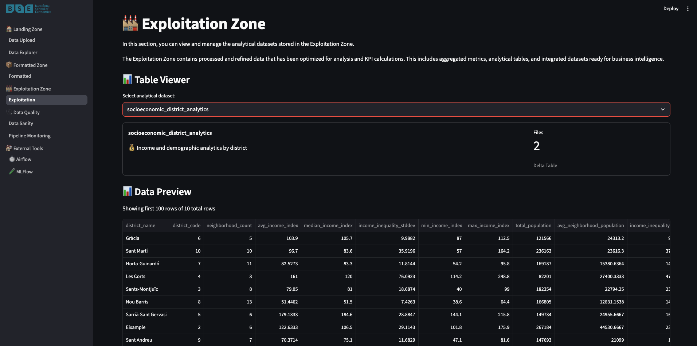

<h1 align="center">🚀 BDM Lab 3: Data Lake Architecture with Spark, MLflow & Airflow</h1>
<p align="center">
  <b><i>L3-T01</i>: Julian Romero & Moritz Peist</b><br>
  <br>
  Big Data Management for Data Science (23D020)
</p>

<p align="center">
  
  
  
  
  
  
</p>

---

## 📑 Index

- [Assignment Completion Overview](#-assignment-completion-overview)
- [Project Architecture](#-project-architecture)
- [Selected Datasets & KPIs](#-selected-datasets--kpis)
- [Technology Stack](#️-technology-stack)
- [Quick Start](#-quick-start)
- [Assignment Task Implementation](#-assignment-task-implementation)
- [Project Structure](#-project-structure)
- [Development Setup](#-development-setup)
- [Key Features & Innovations](#-key-features--innovations)
- [Assignment Deliverables](#-assignment-deliverables)
- [App Overview](#app-overview)
- [Important Notes](#-important-notes)

---

## 📋 Assignment Completion Overview

This project implements all requirements from **Lab 3: Spark** assignment:

### ✅ **Data Management Backbone** (Tasks A.1 - A.4)

- **A.1**: Data exploration and KPI selection ➜ [Completed in notebook with KPI documentation](/notebooks/a1.ipynb)
- **A.2**: Data formatting pipeline ➜ [Spark job: `src/airflow/dags/pipelines/a2.py`](./src/airflow/dags/pipelines/a2.py)
- **A.3**: Exploitation zone pipeline ➜ [Spark job: `src/airflow/dags/pipelines/a3.py`](./src/airflow/dags/pipelines/a3.py)
- **A.4**: Data validation pipeline ➜ [Spark job: `src/airflow/dags/pipelines/a4.py`](./src/airflow/dags/pipelines/a4.py) and validation notebooks per task ([A2](/notebooks/a2_check.ipynb), [A3](/notebooks/a3_check.ipynb))

### ✅ **Data Analysis Backbone** (Tasks B.1 & B.2 - Both Implemented!)

- **B.1**: Descriptive Analysis & Dashboarding ➜ [Streamlit UI with interactive dashboards](./src/streamlit_ui/)
- **B.2**: Predictive Analysis & Model Management ➜ [MLflow tracking + house price prediction](./src/ml_experiments/)

### ✅ **Bonus Point**

- **Orchestration Framework** ➜ [Apache Airflow DAGs for complete pipeline automation](./src/airflow/dags/)

## 🧠 Project Architecture

### 📁 Data Lake Zones (Local File System)

```
data_zones/
├── 01_landing/     # Raw data ingestion (JSON/CSV)
├── 02_formatted/   # Standardized Delta tables  
└── 03_exploitation/ # Analytics-ready datasets
```

### 🔄 Pipeline Flow


## 📊 Selected Datasets & KPIs

Based on **Assignment Task A.1**, we selected these datasets from [Open Data BCN](https://opendata-ajuntament.barcelona.cat/):

### 🏠 **Core Datasets**

1. **Idealista** (JSON, 21,389 records) - Real estate listings with prices, locations, characteristics
2. **Income** (CSV, 811 records) - Socioeconomic data by district/neighborhood (2007-2017)  
3. **Cultural Sites** (CSV, 871 records) - Distribution of cultural amenities across Barcelona

### 📈 **Key Performance Indicators (KPIs)**

Our analysis focuses on **housing affordability, socioeconomic equity, and urban quality of life**:

#### Housing Market KPIs

- Average Price per m² by District
- Property Type Distribution & Pricing
- Market Supply by Neighborhood

#### Socioeconomic KPIs  

- Income Inequality Index (Coefficient of Variation)
- Housing Affordability Ratio (Price vs Income)
- Economic Accessibility Correlation

#### Cultural Accessibility KPIs

- Cultural Density (sites per 1000 residents)
- Cultural-Economic Correlation Analysis
- Amenity Distribution Equity

#### Composite KPIs

- Neighborhood Attractiveness Score
- Spatial Equity Index across Income Quintiles

> 📄 **Detailed KPI documentation**: [Dataset Selection and KPI Definition notebook](/notebooks/a1.ipynb)

## 🛠️ Technology Stack

| Component | Technology | Version | Purpose |
|-----------|------------|---------|---------|
| **Data Processing** | Apache Spark (PySpark) | 4.0 | Distributed ETL and analytics |
| **Data Storage** | Delta Lake | 4.0 | ACID transactions, schema evolution |
| **Orchestration** | Apache Airflow | 3.0.2 | Workflow scheduling and monitoring |
| **ML Tracking** | MLflow | 3.0.0 | Experiment tracking and model registry |
| **Visualization** | Streamlit | Latest | Interactive dashboards and data exploration |
| **Containerization** | Docker & Docker Compose | Latest | Reproducible deployment |

## 🚀 Quick Start

### 1. 📦 Prerequisites

```bash
# Required
docker --version
docker-compose --version

# Optional (for notebooks)
pip install uv
```

### 2. 🐳 Start All Services

```bash
# Clone and navigate
git clone <repository-url>
cd bdm3

# Start the complete stack
docker-compose up --build
```

### 3. 🌐 Access Applications

- **Streamlit App**: [http://localhost:8501](http://localhost:8501) - Main interface for data exploration and pipeline management
- **Airflow UI**: [http://localhost:8080](http://localhost:8080) - Pipeline orchestration and monitoring  
- **MLflow UI**: [http://localhost:5001](http://localhost:5001) - ML experiment tracking and model registry

### 4. 📊 Upload & Process Data

1. **Upload datasets** via Streamlit Landing Zone interface
2. **Trigger pipeline** in Airflow: `bcn_data_pipeline_with_validation`
3. **Monitor progress** through Airflow UI
4. **Explore results** in Streamlit dashboards and MLflow experiments

## 📋 Assignment Task Implementation

### **A.1: Data Exploration & KPI Selection** ✅

- **Location**: `notebooks/a1.ipynb` + [KPI Documentation](/notebooks/a1.ipynb)
- **Deliverable**: Selected 3 datasets (1 JSON + 2 CSV) and defined 10 comprehensive KPIs
- **Validation**: Interactive EDA dashboards in Streamlit

### **A.2: Data Formatting Pipeline** ✅  

- **Location**: [`src/airflow/dags/pipelines/a2.py`](./src/airflow/dags/pipelines/a2.py)
- **Process**: Raw data → Standardized Delta tables with partitioning
- **Output**: `data_zones/02_formatted/` with cleaned, typed data
- **Validation**: Schema enforcement and data quality checks

### **A.3: Exploitation Zone Pipeline** ✅

- **Location**: [`src/airflow/dags/pipelines/a3.py`](./src/airflow/dags/pipelines/a3.py)
- **Process**: Formatted data → Analytics-ready datasets with aggregations
- **Output**: `data_zones/03_exploitation/` with 9 analytical tables
- **Features**: KPI calculations, cross-dataset joins, feature engineering

### **A.4: Data Validation Pipeline** ✅

- **Location**: [`src/airflow/dags/pipelines/a4.py`](./src/airflow/dags/pipelines/a4.py)as well as [A2 Validation Notebook](/notebooks/a2_check.ipynb) and [A3 Validation Notebook](/notebooks/a3_check.ipynb)
- **Process**: Comprehensive data quality assessment and KPI validation  
- **Output**: [JSON reports](/outputs/) for Streamlit consumption + quality metrics
- **Features**: Data integrity checks, performance metrics, recommendations

### **B.1: Descriptive Analysis & Dashboarding** ✅

- **Location**: [`src/streamlit_ui/`](./src/streamlit_ui/)
- **Features**:
  - Interactive data exploration with quality metrics
  - Real-time pipeline monitoring and validation reports
  - Multi-zone data browsing (Landing/Formatted/Exploitation)
  - KPI dashboards with Barcelona housing market insights

### **B.2: Predictive Analysis & Model Management** ✅  

- **Location**: [`src/ml_experiments/house_price_prediction.py`](./src/ml_experiments/house_price_prediction.py)
- **Models**: Linear Regression + Random Forest for house price prediction
- **Features**: MLflow experiment tracking, model registry, automatic deployment
- **Integration**: Airflow DAG for model training and serving pipeline

### **Bonus: Orchestration Framework** ✅

- **Location**: [`src/airflow/dags/airflow_orchestration.py`](./src/airflow/dags/airflow_orchestration.py)
- **Features**: Complete pipeline automation with dependencies, error handling, notifications
- **Compatibility**: Airflow 3.0+ with modern TaskFlow API and DAG versioning

## 📁 Project Structure

```bash
bdm3/
├── 📊 data_zones/              # Data Lake Implementation
│   ├── 01_landing/            # A.2: Raw data ingestion
│   ├── 02_formatted/          # A.3: Standardized Delta tables  
│   └── 03_exploitation/       # A.4: Analytics-ready datasets
│
├── 📓 latex/              # A.1: Exploratory Analysis
│   ├── ...
│   ├── ...
│   └── latex files for documentation
│
├── 📓 notebooks/              # A.1: Exploratory Analysis
│   ├── a1.ipynb             # Data exploration & KPI selection
│   ├── a2.ipynb             # Formatting pipeline development  
│   └── a3.ipynb             # Exploitation pipeline development
│
├── 🔧 src/                   # Application Implementation
│   ├── airflow/              # Bonus: Pipeline Orchestration
│   │   ├── dags/
│   │   │   ├── pipelines/
│   │   │   │   ├── a2.py    # A.2: Data Formatting
│   │   │   │   ├── a3.py    # A.3: Data Exploitation  
│   │   │   │   └── a4.py    # A.4: Data Validation
│   │   │   └── airflow_orchestration.py
│   │   └── Dockerfile
│   │
│   ├── ml_experiments/       # B.2: Predictive Analysis
│   │   └── house_price_prediction.py
│   │
│   ├── streamlit_ui/         # B.1: Dashboarding
│   │   ├── app.py           # Main Streamlit application
│   │   ├── sections/        # Multi-page interface
│   │   └── Dockerfile
│   │
│   └── utils/               # Shared utilities
│       └── eda_dashboard.py # Interactive data exploration
│
├── 📁 outputs/              # Pipeline Outputs
│   └── mlruns/             # MLflow tracking data
│
├── 🐳 docker-compose.yml    # Service orchestration
├── 📋 Dataset Selection and KPI Definition.md  # A.1 Documentation
└── 📖 README.md            # This file
```

## 🔧 Development Setup

### Local Development (Optional)

```bash
# Install uv for Python environment management
curl -LsSf https://astral.sh/uv/install.sh | sh

# Create and sync environment
uv sync

# Run notebooks locally  
uv run jupyter lab notebooks/
```

### Manual Pipeline Execution

```bash
# Run individual pipelines (requires local Spark setup)
python src/airflow/dags/pipelines/a2.py  # Data Formatting
python src/airflow/dags/pipelines/a3.py  # Data Exploitation  
python src/airflow/dags/pipelines/a4.py  # Data Validation
```

## 📈 Key Features & Innovations

### 🏗️ **Modern Data Architecture**

- **Delta Lake 4.0** for ACID transactions and schema evolution
- **Spark 4.0** for distributed data processing  
- **Airflow 3.0** with modern TaskFlow API and DAG versioning

### 📊 **Comprehensive Analytics**

- **10 carefully selected KPIs** addressing housing affordability and urban equity
- **Cross-dataset integration** for neighborhood attractiveness scoring
- **Real-time data quality monitoring** with automated validation reports

### 🤖 **End-to-End ML Pipeline**  

- **Automated model training** with hyperparameter tracking
- **Model registry** with automatic deployment of best-performing models
- **Experiment reproducibility** through MLflow integration

### 🎛️ **Production-Ready Orchestration**

- **Airflow 3.0+ compatibility** with asset-based scheduling
- **Comprehensive error handling** and notification system
- **Pipeline dependency management** with automatic validation

### 🖥️ **User-Friendly Interface**

- **Multi-page Streamlit application** for data exploration and pipeline management
- **Interactive data quality dashboards** with real-time metrics
- **Integrated tool access** (Airflow/MLflow) through embedded interfaces

## 🎯 Assignment Deliverables

✅ **Three Python Scripts/Notebooks**:

- `src/airflow/dags/pipelines/a2.py` (Data Formatting)
- `src/airflow/dags/pipelines/a3.py` (Data Exploitation)  
- `src/airflow/dags/pipelines/a4.py` (Data Validation)

✅ **PDF Documentation**: [Dataset Selection and KPI Definition.md](TODO)

✅ **Additional Implementations**:

- Streamlit dashboarding application (A+B)
- MLflow model management pipeline (B.2)  
- Complete Airflow orchestration (Bonus)

## App Overview

### Zones

---




### Airflow Job Scheduleer

---


### MLFlow Experiments

---


### Data Sanity Dashboard

---


## 🚨 Important Notes

> 💡 **Data Requirements**: The repository already conuts with the initial data [`data_zones/01_landing/`](./data_zones/01_landing/) in order to facilitate running the pipelines.

> ⚠️ **Service Dependencies**: MLflow and Airflow services must be running for full functionality  

> ⚠️ **Resource Usage**: Spark jobs configured for local execution - adjust memory settings in Docker if needed
